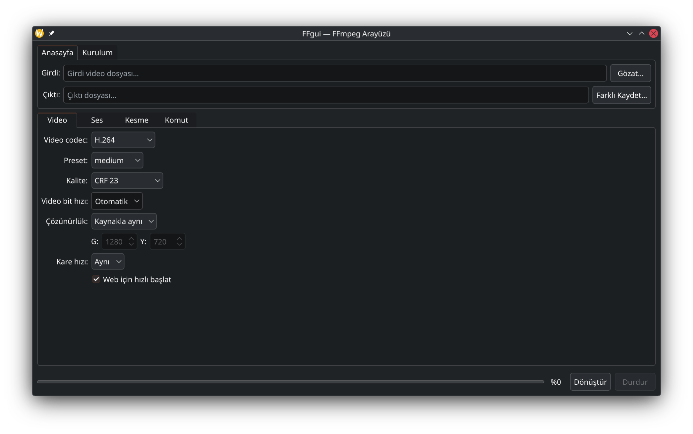
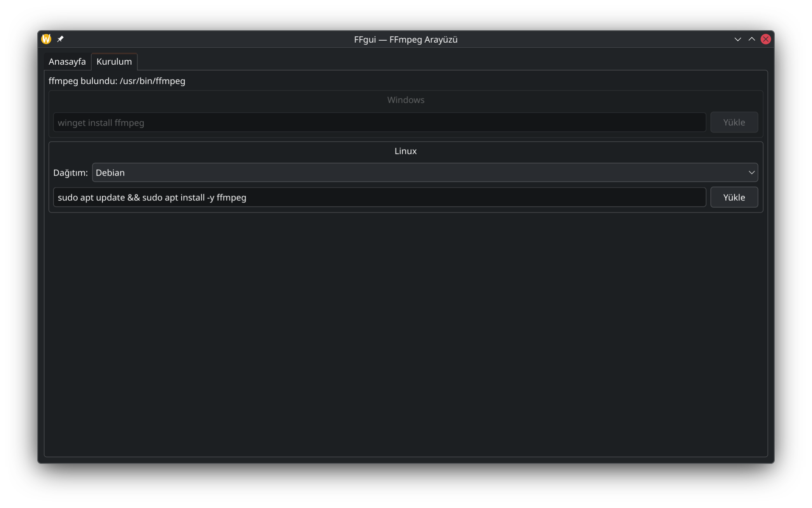

# FFgui

Qt 6 + C++ ile yazılmış, sistem temasıyla uyumlu basit bir FFmpeg arayüzü.

Video dönüştürme seçeneklerini sekmeli bir pencerede toplar, `ffmpeg` komutunu
sizin için oluşturur ve tek tıkla çalıştırır. Özel tema içermez; arayüz
işletim sisteminizin Qt temasını (açık/koyu kip dahil) olduğu gibi kullanır.

## Ekran görüntüleri

| Anasayfa | Kurulum |
|---|---|
|  |  |

## Özellikler

- **Anasayfa** — girdi/çıktı seçimi (native dosya diyalogları)
- **Kurulum** — tek sayfada Windows ve Linux bölümleri
  - Windows: `winget install ffmpeg` komutunu çalıştırır
  - Linux: dağıtım seçimi (Debian, Fedora, Arch Linux hazır komutlu;
    `Diğer…` seçeneğinde komut elle yazılır)
  - Kullanılmayan sistemin bölümü tıklanamaz
- **Video** — codec (H.264, H.265, VP9, AV1, MPEG-4, kopyalama), preset,
  CRF kalitesi / bit hızı, çözünürlük, kare hızı, web için hızlı başlat;
  sağda girdiden rastgele kare önizleme + altında orijinal video bilgileri
- **Ses** — codec (AAC, MP3, Opus, AC-3, kopyalama), bit hızı,
  örnekleme hızı, kanal, sesi kaldırma
- **Kesme** — başlangıç ve süre
- **Altyazı** — harici dosya (`.srt/.ass/.vtt`)
  - `Ayrı kanal olarak ekle`: açılıp kapatılabilen altyazı (`-map`, mp4→`mov_text`, mkv→`srt`)
  - `Görüntüye kalıcı yaz`: geri alınamaz (`-vf subtitles=`), yeniden kodlama zorunludur
- **Komut** — ek `ffmpeg` argümanları + oluşan komutun canlı önizlemesi
  (önizleme yalın `ffmpeg` ile başlar, her sistemde PATH üzerinden çözülür)
- Yalnızca ilerleme çubuğu; `ffmpeg` günlüğü gösterilmez, sonuç ve hata
  özeti pencereyle bildirilir
- Responsive pencere: dar ekranda içerik kayar, kodlayıcı seçenekleri ve
  ilerleme alanı Kurulum sekmesinde gizlenir
- Parantezli açıklamalar arayüzde gösterilmez; ilgili kutunun üzerine
  gelince tooltip olarak görünür

## Güvenlik

- **Üzerine yazma yoktur.** `ffmpeg` her zaman `-n` bayrağıyla çalışır.
- Çıktı dosyası girdiyle aynıysa veya çıktı zaten varsa işlem başlamadan
  engellenir. Orijinal video asla ezilmez.
- Boşluk ve Türkçe karakter içeren dosya adları desteklenir.

## Gereksinimler

| Gereksinim | Açıklama |
|---|---|
| Qt 6 (Widgets) | Arayüz için |
| CMake ≥ 3.21 | Derleme sistemi |
| C++17 derleyicisi | GCC, Clang veya MSVC |
| FFmpeg | Dönüştürme için (`ffprobe` önerilir, süre hesabında kullanılır) |

> FFmpeg kurulu değilse uygulamayı açıp **Kurulum** sekmesini kullanabilirsiniz.

### Linux

Debian / Ubuntu:

```bash
sudo apt install qt6-base-dev cmake g++ ffmpeg
```

Fedora:

```bash
sudo dnf install qt6-qtbase-devel cmake gcc-c++
# ffmpeg için RPM Fusion gerekir, ardından:
sudo dnf install ffmpeg
```

Arch Linux:

```bash
sudo pacman -S qt6-base cmake gcc ffmpeg
```

### Windows

- Qt 6 SDK (Qt çevrimiçi yükleyici, MSVC veya MinGW bileşeniyle)
- CMake ve Visual Studio (C++ iş yüküyle) ya da MinGW
- FFmpeg: uygulamayı açıp **Kurulum** sekmesindeki `Yükle` düğmesini kullanın

## Derleme

```bash
cmake -S . -B build
cmake --build build
```

Çalıştırma:

```bash
./build/FFgui            # Linux
.\build\FFgui.exe        # Windows
```

Windows'ta `cmake` Qt'yi bulamazsa `CMAKE_PREFIX_PATH` verin:

```bash
cmake -S . -B build -DCMAKE_PREFIX_PATH="C:\Qt\6.x.x\msvc2022_64"
```

## Kullanım

1. **Anasayfa** sekmesinde girdi ve çıktı dosyasını seçin.
2. **Video**, **Ses**, **Kesme**, **Altyazı** sekmelerinde seçenekleri ayarlayın
   (bilinmeyen kısaltmalar için fareyle üzerine gelin, tooltip açıklamasını okuyun).
3. Oluşan komutu **Komut** sekmesinde gözden geçirin.
4. **Dönüştür** düğmesine basın; ilerlemeyi çubuktan izleyin.

## Proje yapısı

```text
FFgui/
├── CMakeLists.txt      # Derleme (Qt6 Widgets, C++17)
├── LICENSE             # GPL-3.0-or-later
├── README.md
└── src/
    ├── main.cpp        # Uygulama girişi, tema müdahalesi yok
    ├── MainWindow.h    # Pencere arayüzü bildirimi
    └── MainWindow.cpp  # Arayüz + ffmpeg çalıştırma mantığı
```

## Tema politikası

Bu uygulama bilerek özel tema kodu içermez: `setStyleSheet()`, `setStyle()`
ve özel `QPalette` kullanılmaz. Renkler, yazı tipleri ve stiller sistemin
Qt temasından gelir; simgeler `QStyle::standardIcon()`, dosya diyalogları
native bileşenlerdir.

## Katkı

Hata bildirimi ve iyileştirme önerileri için issue açabilirsiniz.
Değişiklik göndermeden önce projenin temiz derlendiğini doğrulayın:

```bash
cmake -S . -B build && cmake --build build
```

## Lisans

GPL-3.0-or-later. Ayrıntılar için [LICENSE](LICENSE) dosyasına bakın.
